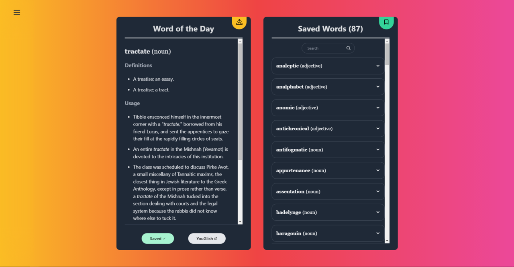

[WIP] 

A reactive and responsive word of the day new tab replacement that serves up a new word every day with usage examples, as well as pronunciation guides powered by YouGlish. 
- Save words that you like to view later
- Search through saved words
- Dark mode support

